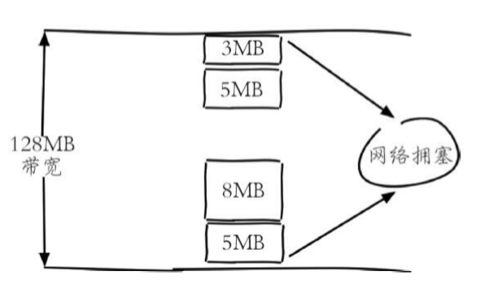
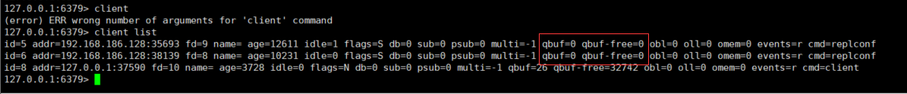
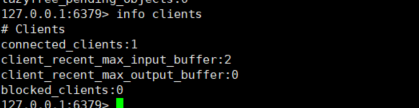

## 一、慢查询

因为 Redis 是单线程的，大量的慢查询可能会导致 redis-server 阻塞，可以通过 slowlog get n 获取慢日志，查看详情情况。

[回到顶部](https://www.cnblogs.com/jmcui/p/13926397.html#top)

## 二、bigkey 大对象

bigkey 大对象可能会导致的问题包括：

- 内存空间不均匀（平衡），例如在 Redis Cluster 中，bigkey 会造成节点的内存空间使用不均匀。
- 超时阻塞：由于Redis 单线程的特性，操作 bigkey 比较耗时，也就意味着阻塞 Redis 的可能性增大。
- 网络阻塞：每次获取 bigkey 产生的网络流量较大，假设一个 bigkey 为 1MB，每次访问量为 1000，那么每秒产生 1000MB 的流量，对于普通的千兆网卡（按照字节算是128MB/s）的服务器简直是灭顶之灾。
  

bigkey 的存在并不是完全致命的，如果这个 bigkey 存在但是几乎不被访问，那么只有内存空间不均匀的问题存在，相对于另外两个问题没有那么重要紧急，但是如果 bigkey 是一个热点key（频繁访问），那么其带来的危害不可想象，所以在实际开发和运维时一定要密切关注 bigkey 的存在。

可以通过 redis-cli -h {ip} -p {port} bigkeys 发现大对象。

[回到顶部](https://www.cnblogs.com/jmcui/p/13926397.html#top)

## 三、swap

因为 Redis 的数据放在内存中，所以存放数据量的多少取决于内存的多少。

如果一个 Redis 实例的内存使用率超过可用最大内存（used_memory > 可用最大内存），那么操作系统开始进行内存和 swap 空间交换，把内存中旧的或不再使用的内容写入硬盘上（硬盘上的这块空间叫 Swap 分区），以便腾出新的物理内存给新页使用。

在硬盘上进行读写操作要比内存上慢了近5个数量级 —— 内存是 0.1μs 单位、硬盘是 10ms。如果 Redis 进程上发生内存交换，那么 Redis 和 依赖 Redis 上数据的应用会受到严重的性能影响。

查看 used_memory 指标可知道 Redis 正在使用的内存情况，识别 Redis 内存交换的检查方法：

1. 识别 redis 进程号

> redis-cli info server | grep process_id

1. 根据进程号查询内存交换信息

> cat /proc/{process_id}/smaps | grep Swap

如果交换量都是 0KB 或者个别 4KB，是正常现象。

预防内存交换：

1. 保证机器充足的可用内存；
2. 确保所有 redis 示例设置最大可用内存（maxmemory），防止极端情况下 redis 内存不可控的增长；
3. 降低系统使用 swap 优先级，如 echo 10>/proc/sys/vm/swappiness。

[回到顶部](https://www.cnblogs.com/jmcui/p/13926397.html#top)

## 四、fork 子进程

在 RDB 生成和 AOF 重写时，会 fork 一个子进程完成持久化工作，当 fork 操作执行太过耗时也会造成阻塞，阻塞原因是该操作会复制父进程的空间内存表，即 fork 操作耗时跟内存量（数据集）关系较大。

fork 操作是重量级操作，会复制父进程的空间内存表（理论上需要复制与父进程同样的内存，但是 linux 有写时复制机制，父子进程贡献相同的物理内存页，实际会小很多，10G 大概只需要 20MB）。

fork 耗时应该在 20ms/GB；应该严格控制每个实例可使用的最大内存 10GB 以内（复制空间内存表）；降低 fork 操作执行频率，适当放宽 AOF 重写触发时机。

使用 info stats 命令获取 lastest_fork_usec 指标，表示 redis 最近一次 fork 操作耗时。

[回到顶部](https://www.cnblogs.com/jmcui/p/13926397.html#top)

## 五、AOF 刷盘阻塞

开启 AOF，文件刷盘一般每秒一次，硬盘压力过大时，fsync 需要等待写入完成。

查看 redis 日志或 info persistence 统计中的 aof_delayed_fsync 指标。

[回到顶部](https://www.cnblogs.com/jmcui/p/13926397.html#top)

## 六、Redis 输入缓冲区可能导致的阻塞

输入缓冲区：redis 为每个客户端分配了输入缓冲区，其会将客户端发送命令临时保存，然后取出来执行。 qbuf 表示总容量（0 表示没有分配查询缓冲区），qbuf-free 表示剩余容量（0 表示没有剩余空间）；大小不能超过 1G，当大小超过 1G 时会将客户端自动关闭，输入缓冲区不受 maxmemory 限制。

当大量的 key 进入输入缓冲区且无法被消费时，即可造成 redis 阻塞；通过 client list 命令可定位发生阻塞的客户端；通过 info clients 命令的 blocked_clients 参数可以查看到当前阻塞的命令。





[回到顶部](https://www.cnblogs.com/jmcui/p/13926397.html#top)

## 七、Redis 输出缓冲区可能导致的阻塞

输出缓冲区（client output buffer）：是 redis-server 端实现的一个读取缓冲区，redis-server 在接收到客户端的请求后，把获取结果写入到 client buffer 中，而不是直接发送给客户端。从而可以继续处理客户端的其他请求，这样异步处理方式使 redis-server 不会因为网络原因阻塞其他请求的处理。

redis client buffer 的配置参数为 "client-output-buffer-limit"，默认值为：

```ruby
127.0.0.1:6379> CONFIG GET "*output*"
1) "client-output-buffer-limit"
2) "normal 0 0 0 slave 0 0 0 pubsub 0 0 0"
```

- class ：客户端种类，normal、slave、pubsub
  - normal：普通的客户端
  - slave： 从库的复制客户端
  - pub/sub: 发布与订阅的客户端
- hard limit: 缓冲区大小的硬性限制。
- soft limit: 缓冲去大小的软性限制。
- soft seconds： 缓冲区大小达到了（超过）soft limit 值的持续时间。

client-output-buffer-limit 参数限制分配的缓冲区的大小，防止内存无节制的分配。参数的默认值都为 0，意思是不做任何限制。

redis server 触发保护机制主要有两种情况：

1. client buffer 的大小达到了 soft limit 并持续了 soft seconds 时间，将立即断开和客户端的连接。
2. client buffer 的大小达到了 hard limit，server 也会立即断开和客户端的连接。

[回到顶部](https://www.cnblogs.com/jmcui/p/13926397.html#top)

## 八、网络问题

### 1. 连接拒绝

- 网络闪断：一般在网络割接或带宽耗尽的情况；
- redis 连接拒绝：连接数大于 maxclients 时拒绝新的连接进入，可以关注 info stats 的 rejected_connections 指标；
- 连接溢出：
  - 进程限制：进程可打开最大文件数控制 —— ulimit -n，通常 1024，大量连接的 redis 需要增大该值；
  - backlog 队列溢出：系统对于特定端口 tcp 连接使用 backlog 队列保存，redis 默认 511，系统 backlog 默认 128，线上可使用 cron 定时执行 netstat -s | grep overflowed 统计；

### 2. 网络延迟

测量机器之间的网络延迟

> redis-cli -h {ip} -p {port} –latency
> redis-cli -h {ip} -p {port} –latency-history 默认15秒完成一行统计，-i控制采样时间
> redis-cli -h {ip} -p {port} –latency-dist 统计图展示，每1秒采样一次