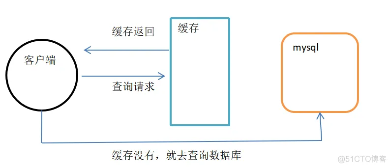
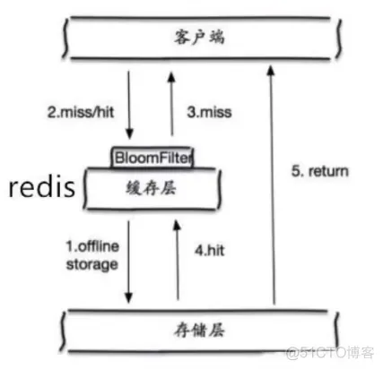
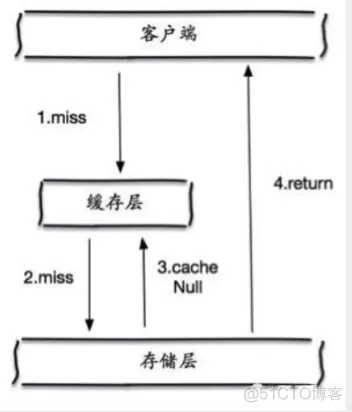
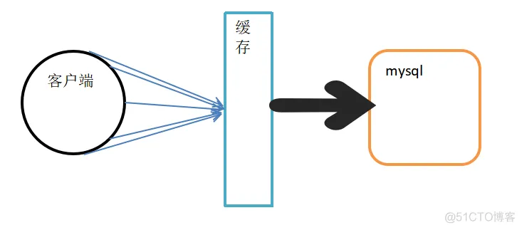
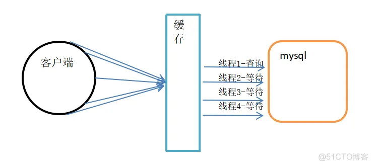

# redis命中率很低获取key会不存在 redis 查看缓存命中

 转载

[mob64ca14085c24](https://blog.51cto.com/u_16213650)2023-08-30 16:44:05

***文章标签\*[redis命中率很低获取key会不存在](https://blog.51cto.com/topic/b24c4efd9fb990a.html)[缓存](https://blog.51cto.com/topic/huancun.html)[redis](https://blog.51cto.com/topic/redis.html)[面试](https://blog.51cto.com/topic/mianshi.html)[java](https://blog.51cto.com/topic/java.html)*****文章分类\*[Redis](https://blog.51cto.com/nav/redis)[数据库](https://blog.51cto.com/nav/database)*****阅读数\**\*19\****

啥也不说了，面试高频问题。

### 一、缓存穿透

用户想要查询一个数据，发现redis内存数据库中没有，也就是说没有命中缓存，也是会向持久层数据库查询，发现也没有，那么本次查询失败。

如果此时，用户很多，高并发场景下都去查这个数据，由于缓存都没有命中，于是压力直接打到持久层数据库那里，这就是缓存穿透。

通常情况下：

- 客户端请求需要查询数据，会先去缓存查询。
- 若缓存存在数据，就直接返回。
- 如果缓存不存在，则去mysql查询。

这种场景是比较常见的，比如大家熟知的秒杀，在同一时间点会集中并发请求过来，如果数据库被冲垮了，可能会造成不可预估的后果。

如何解决？

#### 1. 布隆过滤器

这是一种数据结构，对所有可能查询的参数以hash形式存储。当查询过来的时候，先在过滤器里进行校验，若查不到数据直接丢弃，避免对底层存储系统的查询造成压力。

不过布隆过滤器之所以能做到在时间和空间上的效率比较高，是因为牺牲了判断的准确率，可能会存在误判，简而言之：

- 当布隆过滤器说某个值存在时，这个值可能不存在
- 当布隆过滤器说不存在时，那就肯定不存在

#### 2. 缓存空对象

当持久层数据库也没查询到数据，即使返回的空对象也将其缓存起来，同时设置一个过期时间，之后再次查询这个数据就直接从缓存里取，只不过是空的，从而保护持久层数据库。

但是这种处理方法，也会带来一些问题：

- 如果存在很多的空值的 key，那么这些key都会被缓存起来，耗费更多的空间。
- 即使对空值设置了过期时间，仍然会存在，缓存层与持久层的数据会有一段时间窗口的不一致，这会对需要保持一致性的业务产生影响。

### 二、缓存击穿

缓存击穿，是指一个key非常热点，在不停的扛着高并发，如果这个key失效了，在失效的瞬间，持续的并发量就会穿破缓存，直接打到持久层数据库，就像一个防御墙被凿开一个洞。

注意这里跟缓存穿透的区别：

- 缓存穿透是因为查不到导致
- 缓存击穿是因为量太大，缓存过期

最出名还时微博热搜了，当某明星出轨，这个就成了热点key，最终请求通过这一个热点key，压力直接打到底层数据库。

如何解决？

#### 1. 设置热点数据永不过期

从缓存层面来看，没有设置过期时间，所以不会出现缓存过期的问题。

#### 2. 加互斥锁

使用分布式锁，保证对于每个key同时只有一个线程去查询后端服务，其他线程如果没有获得分布式锁的权限，就要等待。这种方式将高并发的压力转移到了分布式锁，所以对分布式锁
的考验非常大。

### 三、缓存雪崩

是指在某一个时间段，缓存集中过期失效，或者redis宕机了。

比如晚上12点有抢购活动，事先把这波商品集中的放到缓存里，假设设置过期时间1小时。那么等1点的时候，这批商品就缓存过期了，而新缓存还没设置进来。如果这时候对这些商品有大量的查询，就会直接落在持久层上。对持久层数据库而言，会产生周期性的压力波峰。

如果是缓存服务器挂了，那么就很糟糕了，很可能持久层数据库瞬间就被冲垮。

如何解决？

#### 1. redis高可用

其实就是加机器，搭建redis集群，异地多活。

#### 2. 限流降级

在缓存失效后，通过加锁或者队列来控制读取数据库写到缓存里的线程数量，比如上面提到的分布式锁。

#### 3. 数据预热

在正式部署之前，先把可能被访问的数据预先访问一遍，这样一来，大量可能会被高频访问的数据会被加载到内存。

### 4. 设置不同过期时间

缓存数据的过期时间设置随机，防止同一时间大量数据过期现象发生。